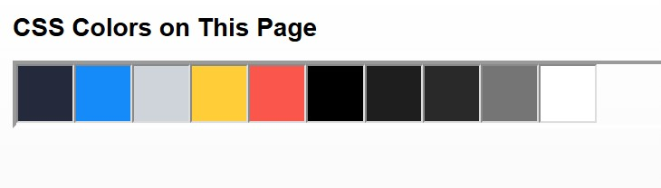
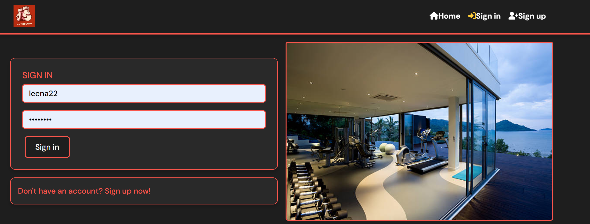
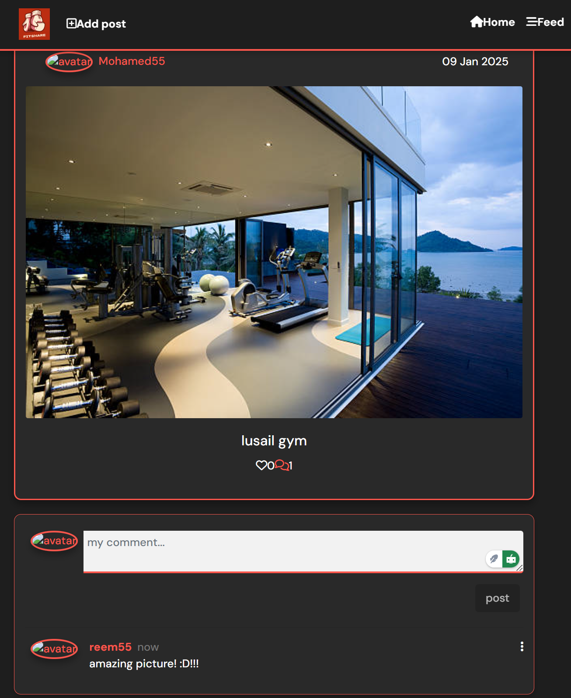
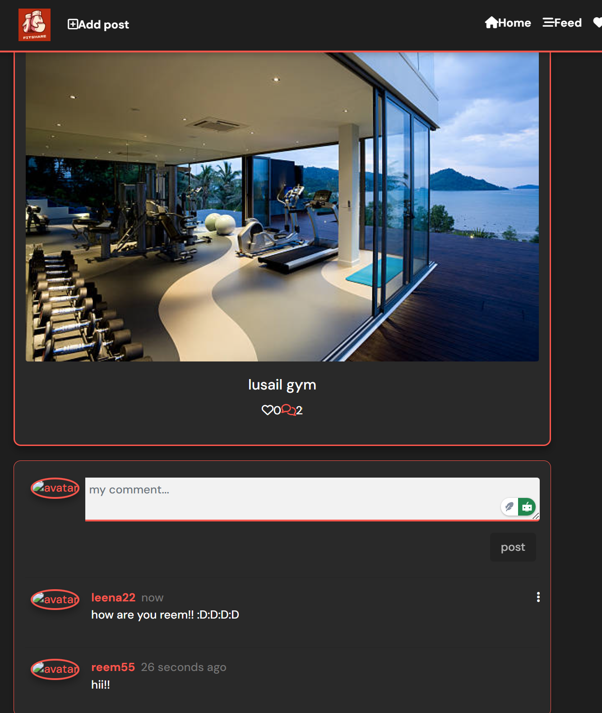
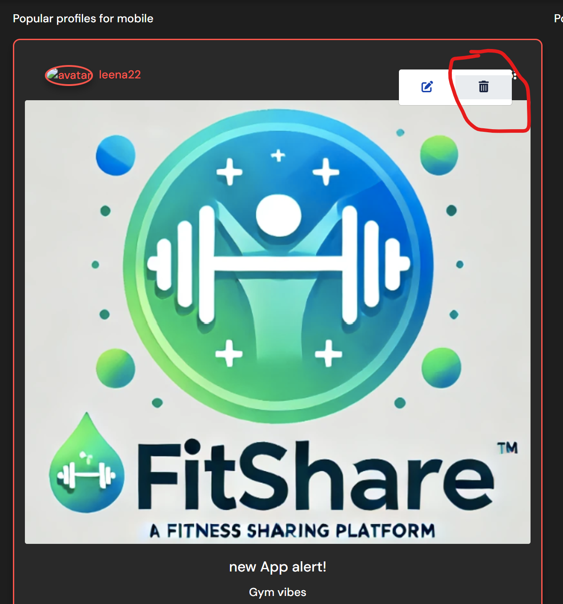
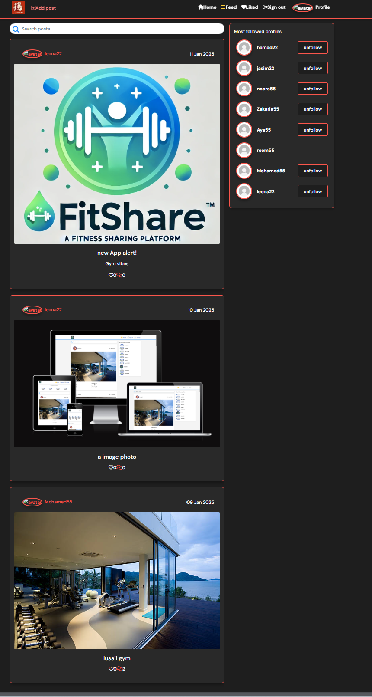
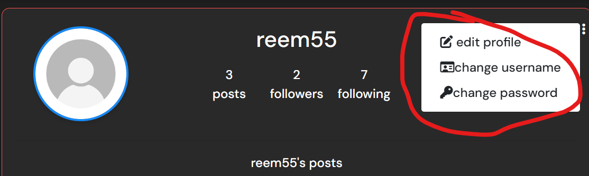
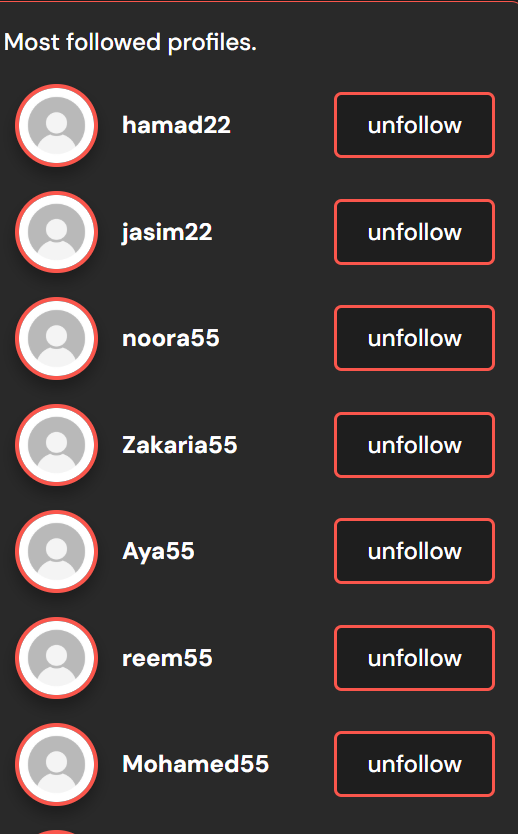
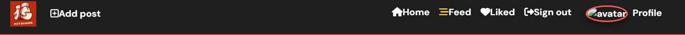

# Fitshare 

**Mohamed Abdillahi**

[Visit live website](https://fitshare-d428ae7f1a9f.herokuapp.com/)  

---

## Table of Contents
  - [About](#about)
  - [Project Goals](#project-goals)
  - [User Stories](#user-stories)
  - [Design](#design)
    - [Colours](#colours)
    - [Fonts](#fonts)
    - [Wireframes](#wireframes)
  - [Technologies Used](#technologies-used)
    - [Languages](#languages)
    - [Libraries, frameworks and dependencies](#libraries-frameworks-and-dependencies)
    - [Tools & Programs](#tools--programs)
  - [Front-End](#front-end)
  - [Back-End API](#back-end-api)
  - [Features](#features)
  - [Future features / improvements](#future-features--improvements)
  - [Validation](#validation)
  - [Testing](#testing)
    - [Manual testing of user stories](#manual-testing-of-user-stories)
    - [Performing tests on various devices](#performing-tests-on-various-devices)
    - [Browser compatibility](#browser-compatibility)
  - [Bugs](#bugs)
  - [Config](#config)
  - [Credits](#credits)

## About

Fitshare is a social platform designed for fitness enthusiasts to connect, share, and discover gyms and fitness facilities. Users can create profiles, share gym-related posts, comment, like, and interact with other fitness enthusiasts. The platform aims to foster a community where users can explore the best gyms and share their fitness journeys.

---

## Project Goals

FitShare is a dynamic social platform designed to connect fitness enthusiasts by enabling them to share their gym experiences, discover new workout spots, and build a supportive community. The project aims to:

1. Provide a seamless platform for users to:
   - Share their gym visits through posts, including images and captions.
   - Engage with others by liking, commenting, and following profiles.

2. Enhance user interaction by offering:
   - The ability to create and manage user profiles.
   - Real-time feedback notifications for actions like posting, commenting, and following.

3. Deliver a superior user experience with:
   - Intuitive navigation and responsive design across all devices.
   - Features such as infinite scrolling, keyword search, and post filtering.

4. Empower users to personalize their experience by:
   - Viewing and editing their profiles and posts.
   - Customizing their feed through follows, likes, and search options.

5. Maintain high accessibility and reliability through:
   - Comprehensive error handling, such as custom 404 pages.
   - Secure authentication and user data management.

## User Stories

### Authentication Backlog
1. As a user, I can create an account to access all features of the platform (Must have).
2. As a user, I can log in and maintain my session until I log out (Must have).
3. As a user, I can log out to securely end my session (Must have).
4. As a user, I can change my password to keep my account secure (Must have).
5. As a user, I can update my username to reflect my identity (Could have).

### Comments Backlog
6. As a user, I can add comments on posts to share my thoughts (Must have).
7. As a user, I can edit my comments to correct or update them (Must have).
8. As a user, I can delete my comments to remove unwanted content (Must have).
9. As a user, I can view all comments on a post to engage with the community (Must have).

### Functionality Backlog
10. As a user, I can navigate the site using a navbar for easy access to all pages (Should have).
11. As a user, I can browse posts using infinite scrolling to avoid navigating through multiple pages (Could have).
12. As a user, I can see a custom 404 error page when accessing invalid URLs (Must have).
13. As a user, I can experience a fully responsive platform across all devices (Must have).
14. As a user, I can see feedback messages for actions like posting, commenting, or editing to confirm successful operations (Must have).

### Post Backlog
15. As a user, I can create posts with images and captions to share my gym experiences (Must have).
16. As a user, I can edit my posts to update or correct information (Should have).
17. As a user, I can delete my posts to remove unwanted content (Should have).
18. As a user, I can like or unlike a post to show my appreciation for the content (Must have).
19. As a user, I can view all posts from other users, sorted by the latest, to discover new gyms and content (Must have).
20. As a user, I can search posts by keywords to find content relevant to my interests (Should have).
21. As a user, I can view detailed information on individual posts, such as comments and likes (Must have).
22. As a user, I can view all posts created by a specific user to follow their content (Should have).

### Profile Backlog
23. As a user, I can view my profile to see my posts and account details (Must have).
24. As a user, I can edit my profile information, including my bio and profile picture (Must have).
25. As a user, I can see statistics on my profile, such as the number of followers and posts (Should have).
26. As a user, I can follow or unfollow other users to customize my feed (Should have).
27. As a user, I can view a list of the most popular profiles to discover new users to follow (Should have).

## Design

### Colours

The colour scheme for FitShare was designed to convey the intensity and energy of fitness and boxing, while maintaining a modern and user-friendly aesthetic. The bold red (`#ff4d4d`) from the logo serves as the primary accent color, symbolizing strength and passion. It is complemented by a deep blue (`#2142b2`) for buttons, links, and borders, representing trust and professionalism. A light grey (`#f4f4f4`) background ensures high contrast and readability throughout the application, while subtle black and white shades (`#333333` and `#ffffff`) are used for text and containers to provide a clean, minimalist look.

colour pallete

These colors were selected to:
- Reflect the rugged, energetic vibe of fitness and boxing.
- Provide excellent readability and user focus on content.
- Ensure seamless contrast and accessibility for all users.

### Implementation
- **Primary Action Buttons**: Deep blue (`#2142b2`) with hover effects transitioning to a darker blue (`#1a337d`), emphasizing interactivity.
- **Error and Warning Highlights**: Red (`#ff4d4d`) for icons like hearts (likes) and error messages, resonating with the boxing glove's dynamic color.
- **Navigation Bar and Search Bar**: Light grey (`#ffffff`) with blue text and highlights for a professional appearance.
- **Interactive Elements**: Gradients and hover effects are used to enhance the visual hierarchy and make buttons and icons more engaging.

The chosen palette ensures the application remains visually striking, aligned with the branding of FitShare, while also offering a user-friendly experience.

### Fonts

FitShare uses **DM Sans** from Google Fonts for its clean and modern look, ideal for a fitness-focused platform. It offers excellent readability with a slightly taller x-height and works well for both headers and body text. Paired with **sans-serif** as a fallback, DM Sans ensures a consistent and professional appearance across all devices.

### Wireframes

## Technologies Used

### Languages
- HTML
- CSS
- JavaScript
  - React (17.0.2)

### Libraries, Frameworks, and Dependencies
- [React](https://reactjs.org/) - Core library for building the user interface of FitShare.
- [React DOM](https://reactjs.org/docs/react-dom.html) - Provides DOM-specific methods for React.
- [React Router DOM](https://v5.reactrouter.com/) - Enables dynamic routing to navigate between pages without reloading.
- [Axios](https://axios-http.com/) - Used for promise-based HTTP requests to communicate with APIs.
- [React-Bootstrap](https://react-bootstrap.github.io/) - Integrates Bootstrap's UI components seamlessly with React for responsive design.
- [Bootstrap](https://getbootstrap.com/) - A CSS framework for building responsive and modern interfaces.
- [React Icons](https://react-icons.github.io/react-icons/) - Provides a collection of popular icons for enhancing the UI.
- [React Infinite Scroll Component](https://www.npmjs.com/package/react-infinite-scroll-component) - Implements infinite scrolling to load posts and comments dynamically.
- [JWT Decode](https://github.com/auth0/jwt-decode) - Decodes JSON Web Tokens for managing authentication.
- [MSW (Mock Service Worker)](https://mswjs.io/) - A testing tool for mocking API requests in development and testing environments.

### Development Tools
- [React Scripts](https://create-react-app.dev/docs/getting-started/) - Includes essential scripts for building, testing, and running the app.
- [Web Vitals](https://web.dev/vitals/) - Used to measure and report performance metrics.
- [Jest](https://jestjs.io/) - A testing framework for unit and integration tests.
- [Testing Library](https://testing-library.com/docs/react-testing-library/intro/) - Simplifies testing React components to ensure they behave correctly.

### Engines
- Node.js: 16.19.1
- NPM: 8.19.3

### Tools & Programs

- [Am I Responsive](http://ami.responsivedesign.is/) - Showcased FitShare's seamless responsiveness across devices with a mock-up preview.
- [Balsamiq](https://balsamiq.com/) - Used to create wireframes for planning the website layout and design.
- [Chrome DevTools](https://developers.google.com/web/tools/chrome-devtools/) - Debugged and fine-tuned the website for optimal responsiveness and performance.
- [Cloudinary](https://cloudinary.com/) - Managed and served high-quality images and media assets efficiently.
- [Colorzilla](https://www.colorzilla.com/) - Used to identify and create the color palette for the website.
- [Favicon Generator](https://favicon.io/) - Designed a custom favicon for consistent branding across tabs.
- [Font Awesome](https://fontawesome.com/) - Enhanced navigation and user interface with sleek and meaningful icons.
- [Google Fonts](https://fonts.google.com/) - Incorporated "DM Sans" for a modern, clean, and fitness-friendly typography.
- [Git](https://git-scm.com/) - Used for version control, enabling collaborative coding and error-free development.
- [GitHub](https://github.com/) - Hosted the FitShare repository, facilitating remote collaboration and deployment.
- [Gitpod](https://gitpod.io/) - Provided a robust development environment to streamline the coding and testing workflow.

#### Validation Tools
- [W3C HTML Validator](https://validator.w3.org/) - Ensured the HTML code adhered to web standards for functionality and compatibility.
- [CSS Validator](https://jigsaw.w3.org/css-validator/) - Checked the CSS for clean syntax and compliance with best practices.
- [ESLint](https://eslint.org/) - Enforced coding standards and identified potential issues in JavaScript and React code.
- [Lighthouse](https://developers.google.com/web/tools/lighthouse/) - Evaluated and optimized performance, SEO, and accessibility metrics.
- [Wave Accessibility Tool](https://wave.webaim.org/) - Ensured the website met accessibility standards for inclusive design.

##### Back to [top](#table-of-contents)

## Front-End: FitShare

**React**  
FitShare is built using **React**, a powerful JavaScript library for creating dynamic and interactive user interfaces. React's flexibility and modular structure make it the perfect choice for developing scalable and maintainable applications like FitShare.

### Why React?
- **Speed**: React improves loading times by dynamically updating components without requiring full-page reloads, ensuring a smooth user experience.
- **Flexibility**: React's modular structure allows for efficient code management and scalability.
- **React Bootstrap**: This library provides pre-built components for styling and responsiveness, enhancing the overall user experience.
- **Popularity**: React powers major platforms like Meta (Facebook), Instagram, and Netflix, proving its reliability for social and media applications.
- **Component Reusability**: React components can be reused across the app, reducing redundancy and simplifying maintenance.

---

### Key Pages and Features
FitShare's modular structure organizes its features into distinct groups:

#### Authentication
- **SignInForm.js**: Handles user login.
- **SignUpForm.js**: Handles user registration.
- **User Stories Covered**: 1, 2, 3.

#### Comments
- **Comment.js**: Displays user comments on posts.
- **CommentCreateForm.js**: Allows users to add new comments.
- **CommentEditForm.js**: Enables users to edit their comments.
- **User Stories Covered**: 6, 7, 8, 9.

#### Posts
- **Post.js**: Displays individual posts with all associated details.
- **PostCreateForm.js**: Handles the creation of new posts.
- **PostEditForm.js**: Enables users to edit their posts.
- **PostPage.js**: Shows detailed information about a single post.
- **PostsPage.js**: Displays a feed of all posts.
- **User Stories Covered**: 15, 16, 17, 18, 19, 20, 21, 22.

#### Profiles
- **PopularProfiles.js**: Displays trending profiles.
- **Profile.js**: Handles individual user profiles.
- **ProfileEditForm.js**: Allows users to update their profile information.
- **ProfilePage.js**: Displays full profile pages.
- **UsernameForm.js**: Enables username updates.
- **UserPasswordForm.js**: Handles password changes.
- **User Stories Covered**: 23, 24, 25, 26, 27.

#### Utilities and Hooks
- **utils.js**: Contains utility functions used throughout the app.
- **useClickOutsideToggle.js**: Manages events for toggling components when clicking outside a specified element.
- **useRedirect.js**: Handles logic for page redirections.

This modular design ensures FitShare is easy to navigate, maintain, and scale.

## Back-End API - FitShare API

The FitShare application is powered by a robust back-end built using the Django REST Framework (DRF). This API handles all data and operations to provide a seamless experience for users. From user authentication to managing posts, comments, and profiles, the API serves as the backbone of FitShare.

Explore the detailed documentation and repository for the DRF Back-End: [FitShare API Repository](https://github.com/Mabdillahi88/fitshare-api).

### Key Features of the API:
- **User Authentication**: Provides secure endpoints for user login, registration, and session management.
- **Post Management**: Full CRUD functionality for creating, updating, deleting, and retrieving posts.
- **Comment Functionality**: Allows users to add, edit, and delete comments on posts.
- **Profile Control**: Enables users to view and edit profiles, manage passwords, and track followers.
- **Search and Filtering**: Supports searching posts and filtering results by keywords, tags, or authors.
- **Performance Optimizations**: Implements efficient serializers and query optimization for fast data responses.

Visit the live FitShare API: [Live API](https://fitshareapi-b9588b2c11b9.herokuapp.com/).

By leveraging Django REST Framework's flexibility and scalability, the FitShare API ensures secure, efficient, and real-time interaction between the front-end and back-end systems, bringing user stories to life.

##### Back to [top](#table-of-contents)

## Features

## Future Features / Improvements

### Authentication
- Introduce multi-factor authentication (MFA) to enhance account security and protect user data.
- Add seamless social login integration (Google, Facebook, LinkedIn) to simplify the sign-up process.
- Implement a robust "Forgot Password" system with email recovery and optional security questions.

### Profile
- Enable private messaging between users to foster a stronger sense of community and engagement.
- Allow users to personalize their profiles with custom themes or background images for a unique look.
- Add a progress tracker for fitness goals, including milestones, achievements, and workout streaks.

### Posts
- Expand post features to include short workout video uploads, inspiring others with visual content.
- Introduce a leaderboard for "Most Liked Posts," spotlighting top creators and motivational stories.
- Enable hashtag functionality to categorize posts, making it easier to discover content by topic (#CardioGoals, #Strength).

### Comments
- Enhance interaction by adding threaded replies for creating dynamic, flowing conversations.
- Include a reaction system for comments, with emojis to express likes, laughter, or even motivation.
- Add a "Pinned Comments" feature for post creators to highlight important or inspiring discussions.

### General Enhancements
- Introduce a sleek Dark Mode to create a gym-like ambiance and improve usability in low-light settings.
- Build a FitShare mobile app with push notifications for likes, comments, and follower updates.
- Add a feature-rich dashboard for users to track engagement, such as post views, likes, and profile visits.

These ideas aim to transform FitShare into the ultimate fitness community hub—engaging, inspiring, and empowering users to reach their goals while connecting with others.

##### Back to [top](#table-of-contents)

## Validation 

## Testing

### Manual Testing of FitShare User Stories

#### Authentication Backlog

1. **As a user, I can create an account to access all features of the platform.**

**Step** | **Expected Result** | **Actual Result**
------------ | ------------ | ------------ |
Navigate to `/signup`, fill in the username, password, and confirm password fields, then submit the form. | Account is created, and the user is redirected to the login page. | Works as expected. |

Screenshot

2. **As a user, I can log in and maintain my session until I log out.**

**Step** | **Expected Result** | **Actual Result**
------------ | ------------ | ------------ |
Navigate to `/signin`, enter valid credentials, and submit the form. | User is authenticated and redirected to the home page with session maintained. | Works as expected. |

Screenshot

3. **As a user, I can log out to securely end my session.**

**Step** | **Expected Result** | **Actual Result**
------------ | ------------ | ------------ |
Click the logout button in the navbar. | User is logged out and redirected to the landing page as a guest. | Works as expected. |

Screenshot

4. **As a user, I can change my password to keep my account secure.**

**Step** | **Expected Result** | **Actual Result**
------------ | ------------ | ------------ |
Navigate to `/profile`, click "Change Password", enter the new password, and save. | Password is updated, and the user receives a confirmation message. | Works as expected. |

Screenshot

5. **As a user, I can update my username to reflect my identity.**

**Step** | **Expected Result** | **Actual Result**
------------ | ------------ | ------------
Navigate to the profile settings page and click on the "Edit Username" option. | The username field becomes editable. | Works as expected.
Enter a new username and click "Save". | The username updates, and a confirmation message is displayed. | Works as expected.
Log out and log back in using the new username. | The new username works for login, and changes are reflected across the app. | Works as expected.

Screenshot

---

#### Comments Backlog

6. **As a user, I can add comments on posts to share my thoughts.**

**Step** | **Expected Result** | **Actual Result**
------------ | ------------ | ------------ |
Navigate to a post, type a comment in the input box, and click "Add Comment". | Comment appears under the post. | Works as expected. |

Screenshot

7. **As a user, I can edit my comments to correct or update them.**

**Step** | **Expected Result** | **Actual Result**
------------ | ------------ | ------------ |
Click the edit button on an existing comment, update the text, and save. | The updated comment replaces the original with a confirmation message. | Works as expected. |

Screenshot

8. **As a user, I can delete my comments to remove unwanted content.**

**Step** | **Expected Result** | **Actual Result**
------------ | ------------ | ------------ |
Click the delete button on a comment. | The comment is removed, and a confirmation message appears. | Works as expected. |

Screenshot

9. **As a user, I can view all comments on a post to engage with the community.**

**Step** | **Expected Result** | **Actual Result**
------------ | ------------ | ------------ |
Navigate to a post page. | Comments are displayed below the post. | Works as expected. |

Screenshot

---

#### Posts Backlog

10. **As a user, I can create posts with images and captions to share my gym experiences.**

**Step** | **Expected Result** | **Actual Result**
------------ | ------------ | ------------ |
Navigate to `/create-post`, upload an image, add a caption, and submit the form. | Post appears on the home feed with the uploaded image and caption. | Works as expected. |

Screenshot

11. **As a user, I can edit my posts to update or correct information.**

**Step** | **Expected Result** | **Actual Result**
------------ | ------------ | ------------ |
Navigate to an existing post, click the "Edit Post" button, make changes, and save. | Post updates with the new information and a confirmation message is displayed. | Works as expected. |

Screenshot

12. **As a user, I can delete my posts to remove unwanted content.**

**Step** | **Expected Result** | **Actual Result**
------------ | ------------ | ------------ |
Click the delete button on an existing post. | Post is removed from the feed, and a confirmation message appears. | Works as expected. |

Screenshot

13. **As a user, I can like or unlike a post to show my appreciation for the content.**

**Step** | **Expected Result** | **Actual Result**
------------ | ------------ | ------------ |
Click the "Like" button under a post. | The like icon toggles, and the like count updates dynamically. | Works as expected. |

Screenshot

14. **As a user, I can view all posts from other users, sorted by the latest, to discover new gyms and content.**

**Step** | **Expected Result** | **Actual Result**
------------ | ------------ | ------------ |
Navigate to the main posts page. | Posts are displayed in descending order of creation time. | Works as expected. |

Screenshot

15. **As a user, I can search posts by keywords to find content relevant to my interests.**

**Step** | **Expected Result** | **Actual Result**
------------ | ------------ | ------------ |
Use the search bar on the main posts page and input a keyword. | Posts containing the keyword in their title, description, or tags are displayed. | Works as expected. |

Screenshots

16. **As a user, I can view detailed information on individual posts, such as comments and likes.**

**Step** | **Expected Result** | **Actual Result**
------------ | ------------ | ------------ |
Click on a post thumbnail from the main posts page. | Redirects to the post details page, displaying comments, like count, and user interactions. | Works as expected. |

Screenshots

17. **As a user, I can view all posts created by a specific user to follow their content.**

**Step** | **Expected Result** | **Actual Result**
------------ | ------------ | ------------ |
Navigate to a user profile and view their posts section. | All posts by the user are displayed. | Works as expected. |

Screenshots

---

#### Profile Backlog

18. **As a user, I can view my profile to see my posts and account details.**

**Step** | **Expected Result** | **Actual Result**
------------ | ------------ | ------------ |
Navigate to `/profile` to view your information and posts. | Profile information and posts are displayed. | Works as expected. |

Screenshot

19. **As a user, I can edit my profile information, including my bio and profile picture.**

**Step** | **Expected Result** | **Actual Result**
------------ | ------------ | ------------ |
Navigate to the profile page, click "Edit Profile", update the bio and upload a new profile picture, then save. | Profile updates are saved, and a confirmation message is displayed. | Works as expected. |

Screenshot

20. **As a user, I can see statistics on my profile, such as the number of followers and posts.**

**Step** | **Expected Result** | **Actual Result**
------------ | ------------ | ------------ |
Navigate to `/profile` and view the stats section. | Statistics such as the number of posts, followers, and following are displayed. | Works as expected. |

Screenshot

21. **As a user, I can follow or unfollow other users to customize my feed.**

**Step** | **Expected Result** | **Actual Result**
------------ | ------------ | ------------ |
Navigate to a user profile and click the "Follow" or "Unfollow" button. | The button toggles, and the user is added or removed from the following list. | Works as expected. |

Screenshot

22. **As a user, I can view a list of the most popular profiles to discover new users to follow.**

**Step** | **Expected Result** | **Actual Result**
------------ | ------------ | ------------ |
Navigate to `/popular-profiles`. | A list of popular profiles is displayed. | Works as expected. |

Screenshot

---

#### Functionality Backlog

23. **As a user, I can navigate the site using a navbar for easy access to all pages.**

**Step** | **Expected Result** | **Actual Result**
------------ | ------------ | ------------ |
Load any page of the application. | Navbar with different links is displayed on top of each page. | Works as expected. |

Screenshot

24. **As a user, I can experience a fully responsive platform across all devices.**

**Step** | **Expected Result** | **Actual Result**
------------ | ------------ | ------------ |
Access the site on devices with varying screen sizes or use browser developer tools. | Layout adjusts seamlessly for all screen sizes. | Works as expected. |

Screenshot

25. **As a user, I can see statistics on my profile, such as the number of followers and posts.**

**Step** | **Expected Result** | **Actual Result**
------------ | ------------ | ------------
Navigate to the profile page. | Profile statistics (e.g., number of followers, number of posts) are displayed. | Works as expected.
Verify that the statistics update dynamically when posts are added or followers change. | The statistics update in real-time. | Works as expected.

Screenshot

26. **As a user, I can see feedback messages for actions like posting, commenting, or editing to confirm successful operations.**

**Step** | **Expected Result** | **Actual Result**
------------ | ------------ | ------------ |
Perform actions such as creating a post, adding a comment, or editing a profile. | Feedback messages appear, confirming successful operations. | Works as expected. |

Screenshots

27. **As a user, I can browse posts using infinite scrolling to avoid navigating through multiple pages.**

**Step** | **Expected Result** | **Actual Result**
------------ | ------------ | ------------ |
Scroll to the bottom of the posts feed. | New posts load automatically without needing to navigate to another page. | Works as expected. |

Screenshots

